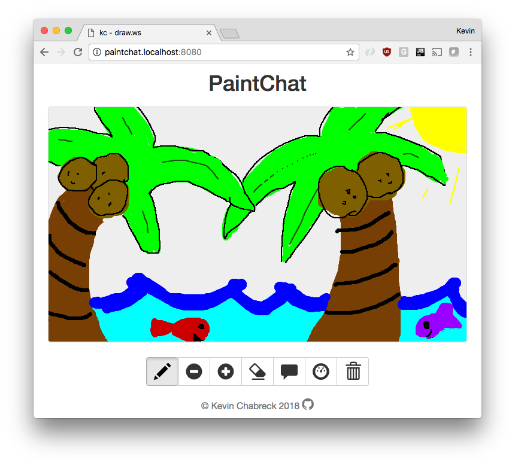
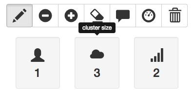

# PaintChat

 

A distributed chatroom with support for real-time collaborative drawing. Think MS Paint meets Google Docs!

[Live demo](http://draw.ws)

## Features

-  run as a single instance or as multiple clustered nodes
-  consistent, persistant state
-  dynamically add/remove nodes at any time

## Getting started

Download and install **[Docker for Mac or Windows](https://www.docker.com/products/overview)**.

### Run a local PaintChat instance

Run in this directory:

    $ docker-compose up

### Connect to the PaintChat cluster

Point your browser to [http://paintchat.localhost:8080/](http://paintchat.localhost:8080/)

_tip: open in multiple tabs for realtime collaborative drawing_

## Advanced usage

Running `docker-compose up` will create 3 containers on your machine:
* __paintchat__: a paintchat server node
* __traefik__: a [traefik](https://docs.traefik.io/) instance for dynamic load balancing
* __cassandra__: a [cassandra](https://hub.docker.com/_/cassandra/) db instance for data persistence

You can run multiple instances of the `paintchat` service together as a cluster. Add additional nodes using the `docker-compose scale` command:

    $ docker-compose scale paintchat=3

This will increase the total number of `paintchat` nodes in the cluster to 3. To confirm, click the __Dashboard__ button in the toolbar - you should now see that the __cluster size__ has increased from 1 to 3.

You can reduce the cluster size in the same way:

    $ docker-compose scale paintchat=1

This will reduce the number of `paintchat` instances in the cluster to 1.

_note: traefik will automatically detect changes to the topology of the system and dynamically adjust its list of upstream hosts - no configuration required!_
